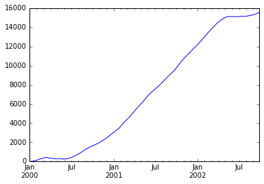
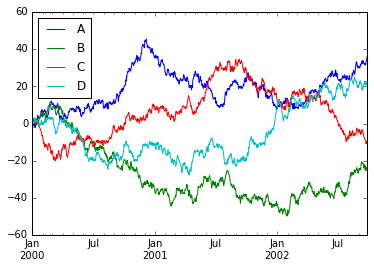

##    10分钟快速学习Pandas系列将主要介绍Pandas的主要用法，如果想使用更加复杂的功能，需要查询pandas document。


```python
#导入pandas，numpy，matplotlib  三个package
import pandas as pd
import numpy as np
import matplotlib.pyplot as plt
%matplotlib inline
```


```python
#创建pandas 数据对象
s = pd.Series([1,2,3,np.nan,5])
s 
```


    0     1
    1     2
    2     3
    3   NaN
    4     5
    dtype: float64


## DataFrame


```python
dates = pd.date_range('20160607',periods=6)
dates.values
```


    array(['2016-06-07T00:00:00.000000000', '2016-06-08T00:00:00.000000000',
           '2016-06-09T00:00:00.000000000', '2016-06-10T00:00:00.000000000',
           '2016-06-11T00:00:00.000000000', '2016-06-12T00:00:00.000000000'], dtype='datetime64[ns]')


```python
dates
```


    DatetimeIndex(['2016-06-07', '2016-06-08', '2016-06-09', '2016-06-10',
                   '2016-06-11', '2016-06-12'],
                  dtype='datetime64[ns]', freq='D')


```python
df = pd.DataFrame(np.random.randn(6,4),index=dates,columns=list('ABCD'))
df
```


<div>
<table border="1" class="dataframe">
  <thead>
    <tr style="text-align: right;">
      <th></th>
      <th>A</th>
      <th>B</th>
      <th>C</th>
      <th>D</th>
    </tr>
  </thead>
  <tbody>
    <tr>
      <th>2016-06-07</th>
      <td>-2.743819</td>
      <td>0.836499</td>
      <td>0.351330</td>
      <td>1.147885</td>
    </tr>
    <tr>
      <th>2016-06-08</th>
      <td>-0.469884</td>
      <td>-0.109955</td>
      <td>0.455221</td>
      <td>0.872270</td>
    </tr>
    <tr>
      <th>2016-06-09</th>
      <td>0.358007</td>
      <td>0.418778</td>
      <td>0.638334</td>
      <td>-1.051129</td>
    </tr>
    <tr>
      <th>2016-06-10</th>
      <td>2.030083</td>
      <td>0.535692</td>
      <td>-0.266529</td>
      <td>-2.624766</td>
    </tr>
    <tr>
      <th>2016-06-11</th>
      <td>-0.354791</td>
      <td>-1.511650</td>
      <td>-0.388937</td>
      <td>0.354155</td>
    </tr>
    <tr>
      <th>2016-06-12</th>
      <td>0.391398</td>
      <td>1.511796</td>
      <td>1.216850</td>
      <td>-0.285288</td>
    </tr>
  </tbody>
</table>
</div>


## 字典转换成序列


```python
df2 = pd.DataFrame({
        'A':1,
        'B':pd.Timestamp('20160607'),
        'C':pd.Series(1,index=list(range(4)),dtype='float32'),
        'D':np.array([3]*4,dtype='int32'),
        'E':pd.Categorical(["test","train","test","train"]),
        'F':'foo'
    })
df2
```


<div>
<table border="1" class="dataframe">
  <thead>
    <tr style="text-align: right;">
      <th></th>
      <th>A</th>
      <th>B</th>
      <th>C</th>
      <th>D</th>
      <th>E</th>
      <th>F</th>
    </tr>
  </thead>
  <tbody>
    <tr>
      <th>0</th>
      <td>1</td>
      <td>2016-06-07</td>
      <td>1</td>
      <td>3</td>
      <td>test</td>
      <td>foo</td>
    </tr>
    <tr>
      <th>1</th>
      <td>1</td>
      <td>2016-06-07</td>
      <td>1</td>
      <td>3</td>
      <td>train</td>
      <td>foo</td>
    </tr>
    <tr>
      <th>2</th>
      <td>1</td>
      <td>2016-06-07</td>
      <td>1</td>
      <td>3</td>
      <td>test</td>
      <td>foo</td>
    </tr>
    <tr>
      <th>3</th>
      <td>1</td>
      <td>2016-06-07</td>
      <td>1</td>
      <td>3</td>
      <td>train</td>
      <td>foo</td>
    </tr>
  </tbody>
</table>
</div>


```python
df.head()
```


<div>
<table border="1" class="dataframe">
  <thead>
    <tr style="text-align: right;">
      <th></th>
      <th>A</th>
      <th>B</th>
      <th>C</th>
      <th>D</th>
    </tr>
  </thead>
  <tbody>
    <tr>
      <th>2016-06-07</th>
      <td>-2.743819</td>
      <td>0.836499</td>
      <td>0.351330</td>
      <td>1.147885</td>
    </tr>
    <tr>
      <th>2016-06-08</th>
      <td>-0.469884</td>
      <td>-0.109955</td>
      <td>0.455221</td>
      <td>0.872270</td>
    </tr>
    <tr>
      <th>2016-06-09</th>
      <td>0.358007</td>
      <td>0.418778</td>
      <td>0.638334</td>
      <td>-1.051129</td>
    </tr>
    <tr>
      <th>2016-06-10</th>
      <td>2.030083</td>
      <td>0.535692</td>
      <td>-0.266529</td>
      <td>-2.624766</td>
    </tr>
    <tr>
      <th>2016-06-11</th>
      <td>-0.354791</td>
      <td>-1.511650</td>
      <td>-0.388937</td>
      <td>0.354155</td>
    </tr>
  </tbody>
</table>
</div>


```python
df.tail()
```


<div>
<table border="1" class="dataframe">
  <thead>
    <tr style="text-align: right;">
      <th></th>
      <th>A</th>
      <th>B</th>
      <th>C</th>
      <th>D</th>
    </tr>
  </thead>
  <tbody>
    <tr>
      <th>2016-06-08</th>
      <td>-0.469884</td>
      <td>-0.109955</td>
      <td>0.455221</td>
      <td>0.872270</td>
    </tr>
    <tr>
      <th>2016-06-09</th>
      <td>0.358007</td>
      <td>0.418778</td>
      <td>0.638334</td>
      <td>-1.051129</td>
    </tr>
    <tr>
      <th>2016-06-10</th>
      <td>2.030083</td>
      <td>0.535692</td>
      <td>-0.266529</td>
      <td>-2.624766</td>
    </tr>
    <tr>
      <th>2016-06-11</th>
      <td>-0.354791</td>
      <td>-1.511650</td>
      <td>-0.388937</td>
      <td>0.354155</td>
    </tr>
    <tr>
      <th>2016-06-12</th>
      <td>0.391398</td>
      <td>1.511796</td>
      <td>1.216850</td>
      <td>-0.285288</td>
    </tr>
  </tbody>
</table>
</div>


```python
df.columns
```


    Index([u'A', u'B', u'C', u'D'], dtype='object')


```python
df.values
```


    array([[-2.7438191 ,  0.83649909,  0.35132987,  1.1478854 ],
           [-0.46988359, -0.10995532,  0.45522054,  0.87226969],
           [ 0.35800692,  0.41877771,  0.63833415, -1.05112934],
           [ 2.03008308,  0.53569176, -0.26652933, -2.62476617],
           [-0.35479121, -1.51165011, -0.38893679,  0.35415496],
           [ 0.39139836,  1.51179617,  1.21685034, -0.28528789]])


```python
df.describe()
```


<div>
<table border="1" class="dataframe">
  <thead>
    <tr style="text-align: right;">
      <th></th>
      <th>A</th>
      <th>B</th>
      <th>C</th>
      <th>D</th>
    </tr>
  </thead>
  <tbody>
    <tr>
      <th>count</th>
      <td>6.000000</td>
      <td>6.000000</td>
      <td>6.000000</td>
      <td>6.000000</td>
    </tr>
    <tr>
      <th>mean</th>
      <td>-0.131501</td>
      <td>0.280193</td>
      <td>0.334378</td>
      <td>-0.264479</td>
    </tr>
    <tr>
      <th>std</th>
      <td>1.560388</td>
      <td>1.027008</td>
      <td>0.595031</td>
      <td>1.404271</td>
    </tr>
    <tr>
      <th>min</th>
      <td>-2.743819</td>
      <td>-1.511650</td>
      <td>-0.388937</td>
      <td>-2.624766</td>
    </tr>
    <tr>
      <th>25%</th>
      <td>-0.441110</td>
      <td>0.022228</td>
      <td>-0.112065</td>
      <td>-0.859669</td>
    </tr>
    <tr>
      <th>50%</th>
      <td>0.001608</td>
      <td>0.477235</td>
      <td>0.403275</td>
      <td>0.034434</td>
    </tr>
    <tr>
      <th>75%</th>
      <td>0.383050</td>
      <td>0.761297</td>
      <td>0.592556</td>
      <td>0.742741</td>
    </tr>
    <tr>
      <th>max</th>
      <td>2.030083</td>
      <td>1.511796</td>
      <td>1.216850</td>
      <td>1.147885</td>
    </tr>
  </tbody>
</table>
</div>


## 转置


```python
df.T
```


<div>
<table border="1" class="dataframe">
  <thead>
    <tr style="text-align: right;">
      <th></th>
      <th>2016-06-07 00:00:00</th>
      <th>2016-06-08 00:00:00</th>
      <th>2016-06-09 00:00:00</th>
      <th>2016-06-10 00:00:00</th>
      <th>2016-06-11 00:00:00</th>
      <th>2016-06-12 00:00:00</th>
    </tr>
  </thead>
  <tbody>
    <tr>
      <th>A</th>
      <td>-2.743819</td>
      <td>-0.469884</td>
      <td>0.358007</td>
      <td>2.030083</td>
      <td>-0.354791</td>
      <td>0.391398</td>
    </tr>
    <tr>
      <th>B</th>
      <td>0.836499</td>
      <td>-0.109955</td>
      <td>0.418778</td>
      <td>0.535692</td>
      <td>-1.511650</td>
      <td>1.511796</td>
    </tr>
    <tr>
      <th>C</th>
      <td>0.351330</td>
      <td>0.455221</td>
      <td>0.638334</td>
      <td>-0.266529</td>
      <td>-0.388937</td>
      <td>1.216850</td>
    </tr>
    <tr>
      <th>D</th>
      <td>1.147885</td>
      <td>0.872270</td>
      <td>-1.051129</td>
      <td>-2.624766</td>
      <td>0.354155</td>
      <td>-0.285288</td>
    </tr>
  </tbody>
</table>
</div>


## 按列排序


```python
df.sort_index(axis=1,ascending=False)
```


<div>
<table border="1" class="dataframe">
  <thead>
    <tr style="text-align: right;">
      <th></th>
      <th>D</th>
      <th>C</th>
      <th>B</th>
      <th>A</th>
    </tr>
  </thead>
  <tbody>
    <tr>
      <th>2016-06-07</th>
      <td>1.147885</td>
      <td>0.351330</td>
      <td>0.836499</td>
      <td>-2.743819</td>
    </tr>
    <tr>
      <th>2016-06-08</th>
      <td>0.872270</td>
      <td>0.455221</td>
      <td>-0.109955</td>
      <td>-0.469884</td>
    </tr>
    <tr>
      <th>2016-06-09</th>
      <td>-1.051129</td>
      <td>0.638334</td>
      <td>0.418778</td>
      <td>0.358007</td>
    </tr>
    <tr>
      <th>2016-06-10</th>
      <td>-2.624766</td>
      <td>-0.266529</td>
      <td>0.535692</td>
      <td>2.030083</td>
    </tr>
    <tr>
      <th>2016-06-11</th>
      <td>0.354155</td>
      <td>-0.388937</td>
      <td>-1.511650</td>
      <td>-0.354791</td>
    </tr>
    <tr>
      <th>2016-06-12</th>
      <td>-0.285288</td>
      <td>1.216850</td>
      <td>1.511796</td>
      <td>0.391398</td>
    </tr>
  </tbody>
</table>
</div>


```python
df.sort_values(by='B')
```


<div>
<table border="1" class="dataframe">
  <thead>
    <tr style="text-align: right;">
      <th></th>
      <th>A</th>
      <th>B</th>
      <th>C</th>
      <th>D</th>
    </tr>
  </thead>
  <tbody>
    <tr>
      <th>2016-06-11</th>
      <td>-0.354791</td>
      <td>-1.511650</td>
      <td>-0.388937</td>
      <td>0.354155</td>
    </tr>
    <tr>
      <th>2016-06-08</th>
      <td>-0.469884</td>
      <td>-0.109955</td>
      <td>0.455221</td>
      <td>0.872270</td>
    </tr>
    <tr>
      <th>2016-06-09</th>
      <td>0.358007</td>
      <td>0.418778</td>
      <td>0.638334</td>
      <td>-1.051129</td>
    </tr>
    <tr>
      <th>2016-06-10</th>
      <td>2.030083</td>
      <td>0.535692</td>
      <td>-0.266529</td>
      <td>-2.624766</td>
    </tr>
    <tr>
      <th>2016-06-07</th>
      <td>-2.743819</td>
      <td>0.836499</td>
      <td>0.351330</td>
      <td>1.147885</td>
    </tr>
    <tr>
      <th>2016-06-12</th>
      <td>0.391398</td>
      <td>1.511796</td>
      <td>1.216850</td>
      <td>-0.285288</td>
    </tr>
  </tbody>
</table>
</div>


## 筛选数据


```python
df['A']
```


    2016-06-07   -2.743819
    2016-06-08   -0.469884
    2016-06-09    0.358007
    2016-06-10    2.030083
    2016-06-11   -0.354791
    2016-06-12    0.391398
    Freq: D, Name: A, dtype: float64


```python
df.loc[:,['A','B']]
```


<div>
<table border="1" class="dataframe">
  <thead>
    <tr style="text-align: right;">
      <th></th>
      <th>A</th>
      <th>B</th>
    </tr>
  </thead>
  <tbody>
    <tr>
      <th>2016-06-07</th>
      <td>-2.743819</td>
      <td>0.836499</td>
    </tr>
    <tr>
      <th>2016-06-08</th>
      <td>-0.469884</td>
      <td>-0.109955</td>
    </tr>
    <tr>
      <th>2016-06-09</th>
      <td>0.358007</td>
      <td>0.418778</td>
    </tr>
    <tr>
      <th>2016-06-10</th>
      <td>2.030083</td>
      <td>0.535692</td>
    </tr>
    <tr>
      <th>2016-06-11</th>
      <td>-0.354791</td>
      <td>-1.511650</td>
    </tr>
    <tr>
      <th>2016-06-12</th>
      <td>0.391398</td>
      <td>1.511796</td>
    </tr>
  </tbody>
</table>
</div>


```python
df.loc['20160605':'20160607',['A','B']]
```


<div>
<table border="1" class="dataframe">
  <thead>
    <tr style="text-align: right;">
      <th></th>
      <th>A</th>
      <th>B</th>
    </tr>
  </thead>
  <tbody>
    <tr>
      <th>2016-06-07</th>
      <td>-2.743819</td>
      <td>0.836499</td>
    </tr>
  </tbody>
</table>
</div>


```python
df.loc['20160607',['A','B']]
```


    A   -2.743819
    B    0.836499
    Name: 2016-06-07 00:00:00, dtype: float64


```python
df.loc[dates[0],'A']
```


    -2.743819098711612


```python
df.iloc[3]
```


    A    2.030083
    B    0.535692
    C   -0.266529
    D   -2.624766
    Name: 2016-06-10 00:00:00, dtype: float64


```python
df.iloc[1:3,:]
```


<div>
<table border="1" class="dataframe">
  <thead>
    <tr style="text-align: right;">
      <th></th>
      <th>A</th>
      <th>B</th>
      <th>C</th>
      <th>D</th>
    </tr>
  </thead>
  <tbody>
    <tr>
      <th>2016-06-08</th>
      <td>-0.469884</td>
      <td>-0.109955</td>
      <td>0.455221</td>
      <td>0.872270</td>
    </tr>
    <tr>
      <th>2016-06-09</th>
      <td>0.358007</td>
      <td>0.418778</td>
      <td>0.638334</td>
      <td>-1.051129</td>
    </tr>
  </tbody>
</table>
</div>


```python
df.iloc[:,1:3]
```


<div>
<table border="1" class="dataframe">
  <thead>
    <tr style="text-align: right;">
      <th></th>
      <th>B</th>
      <th>C</th>
    </tr>
  </thead>
  <tbody>
    <tr>
      <th>2016-06-07</th>
      <td>0.836499</td>
      <td>0.351330</td>
    </tr>
    <tr>
      <th>2016-06-08</th>
      <td>-0.109955</td>
      <td>0.455221</td>
    </tr>
    <tr>
      <th>2016-06-09</th>
      <td>0.418778</td>
      <td>0.638334</td>
    </tr>
    <tr>
      <th>2016-06-10</th>
      <td>0.535692</td>
      <td>-0.266529</td>
    </tr>
    <tr>
      <th>2016-06-11</th>
      <td>-1.511650</td>
      <td>-0.388937</td>
    </tr>
    <tr>
      <th>2016-06-12</th>
      <td>1.511796</td>
      <td>1.216850</td>
    </tr>
  </tbody>
</table>
</div>


## 布尔索引


```python
df[df.A>0]
```


<div>
<table border="1" class="dataframe">
  <thead>
    <tr style="text-align: right;">
      <th></th>
      <th>A</th>
      <th>B</th>
      <th>C</th>
      <th>D</th>
    </tr>
  </thead>
  <tbody>
    <tr>
      <th>2016-06-09</th>
      <td>0.358007</td>
      <td>0.418778</td>
      <td>0.638334</td>
      <td>-1.051129</td>
    </tr>
    <tr>
      <th>2016-06-10</th>
      <td>2.030083</td>
      <td>0.535692</td>
      <td>-0.266529</td>
      <td>-2.624766</td>
    </tr>
    <tr>
      <th>2016-06-12</th>
      <td>0.391398</td>
      <td>1.511796</td>
      <td>1.216850</td>
      <td>-0.285288</td>
    </tr>
  </tbody>
</table>
</div>


```python
df[df>0]
```


<div>
<table border="1" class="dataframe">
  <thead>
    <tr style="text-align: right;">
      <th></th>
      <th>A</th>
      <th>B</th>
      <th>C</th>
      <th>D</th>
    </tr>
  </thead>
  <tbody>
    <tr>
      <th>2016-06-07</th>
      <td>NaN</td>
      <td>0.836499</td>
      <td>0.351330</td>
      <td>1.147885</td>
    </tr>
    <tr>
      <th>2016-06-08</th>
      <td>NaN</td>
      <td>NaN</td>
      <td>0.455221</td>
      <td>0.872270</td>
    </tr>
    <tr>
      <th>2016-06-09</th>
      <td>0.358007</td>
      <td>0.418778</td>
      <td>0.638334</td>
      <td>NaN</td>
    </tr>
    <tr>
      <th>2016-06-10</th>
      <td>2.030083</td>
      <td>0.535692</td>
      <td>NaN</td>
      <td>NaN</td>
    </tr>
    <tr>
      <th>2016-06-11</th>
      <td>NaN</td>
      <td>NaN</td>
      <td>NaN</td>
      <td>0.354155</td>
    </tr>
    <tr>
      <th>2016-06-12</th>
      <td>0.391398</td>
      <td>1.511796</td>
      <td>1.216850</td>
      <td>NaN</td>
    </tr>
  </tbody>
</table>
</div>


```python
df2 = df.copy()
df2['E']=['one', 'one','two','three','four','three']
df2
```


<div>
<table border="1" class="dataframe">
  <thead>
    <tr style="text-align: right;">
      <th></th>
      <th>A</th>
      <th>B</th>
      <th>C</th>
      <th>D</th>
      <th>E</th>
    </tr>
  </thead>
  <tbody>
    <tr>
      <th>2016-06-07</th>
      <td>-2.743819</td>
      <td>0.836499</td>
      <td>0.351330</td>
      <td>1.147885</td>
      <td>one</td>
    </tr>
    <tr>
      <th>2016-06-08</th>
      <td>-0.469884</td>
      <td>-0.109955</td>
      <td>0.455221</td>
      <td>0.872270</td>
      <td>one</td>
    </tr>
    <tr>
      <th>2016-06-09</th>
      <td>0.358007</td>
      <td>0.418778</td>
      <td>0.638334</td>
      <td>-1.051129</td>
      <td>two</td>
    </tr>
    <tr>
      <th>2016-06-10</th>
      <td>2.030083</td>
      <td>0.535692</td>
      <td>-0.266529</td>
      <td>-2.624766</td>
      <td>three</td>
    </tr>
    <tr>
      <th>2016-06-11</th>
      <td>-0.354791</td>
      <td>-1.511650</td>
      <td>-0.388937</td>
      <td>0.354155</td>
      <td>four</td>
    </tr>
    <tr>
      <th>2016-06-12</th>
      <td>0.391398</td>
      <td>1.511796</td>
      <td>1.216850</td>
      <td>-0.285288</td>
      <td>three</td>
    </tr>
  </tbody>
</table>
</div>


```python
df2[df2['E'].isin(['two','four'])]
```


<div>
<table border="1" class="dataframe">
  <thead>
    <tr style="text-align: right;">
      <th></th>
      <th>A</th>
      <th>B</th>
      <th>C</th>
      <th>D</th>
      <th>E</th>
    </tr>
  </thead>
  <tbody>
    <tr>
      <th>2016-06-09</th>
      <td>0.358007</td>
      <td>0.418778</td>
      <td>0.638334</td>
      <td>-1.051129</td>
      <td>two</td>
    </tr>
    <tr>
      <th>2016-06-11</th>
      <td>-0.354791</td>
      <td>-1.511650</td>
      <td>-0.388937</td>
      <td>0.354155</td>
      <td>four</td>
    </tr>
  </tbody>
</table>
</div>


```python
s1 = pd.Series([1,2,3,4,5,6], index=pd.date_range('20130102', periods=6))
```


```python
s1
```


    2013-01-02    1
    2013-01-03    2
    2013-01-04    3
    2013-01-05    4
    2013-01-06    5
    2013-01-07    6
    Freq: D, dtype: int64


```python
df1 = df.reindex(index=dates[0:4],columns=list(df.columns)+['E'])
df1.loc[dates[0]:dates[1],'E']=1
df1
```


<div>
<table border="1" class="dataframe">
  <thead>
    <tr style="text-align: right;">
      <th></th>
      <th>A</th>
      <th>B</th>
      <th>C</th>
      <th>D</th>
      <th>E</th>
    </tr>
  </thead>
  <tbody>
    <tr>
      <th>2016-06-07</th>
      <td>-2.743819</td>
      <td>0.836499</td>
      <td>0.351330</td>
      <td>1.147885</td>
      <td>1</td>
    </tr>
    <tr>
      <th>2016-06-08</th>
      <td>-0.469884</td>
      <td>-0.109955</td>
      <td>0.455221</td>
      <td>0.872270</td>
      <td>1</td>
    </tr>
    <tr>
      <th>2016-06-09</th>
      <td>0.358007</td>
      <td>0.418778</td>
      <td>0.638334</td>
      <td>-1.051129</td>
      <td>NaN</td>
    </tr>
    <tr>
      <th>2016-06-10</th>
      <td>2.030083</td>
      <td>0.535692</td>
      <td>-0.266529</td>
      <td>-2.624766</td>
      <td>NaN</td>
    </tr>
  </tbody>
</table>
</div>


```python
df.dropna()
```


<div>
<table border="1" class="dataframe">
  <thead>
    <tr style="text-align: right;">
      <th></th>
      <th>A</th>
      <th>B</th>
      <th>C</th>
      <th>D</th>
    </tr>
  </thead>
  <tbody>
    <tr>
      <th>2016-06-07</th>
      <td>-2.743819</td>
      <td>0.836499</td>
      <td>0.351330</td>
      <td>1.147885</td>
    </tr>
    <tr>
      <th>2016-06-08</th>
      <td>-0.469884</td>
      <td>-0.109955</td>
      <td>0.455221</td>
      <td>0.872270</td>
    </tr>
    <tr>
      <th>2016-06-09</th>
      <td>0.358007</td>
      <td>0.418778</td>
      <td>0.638334</td>
      <td>-1.051129</td>
    </tr>
    <tr>
      <th>2016-06-10</th>
      <td>2.030083</td>
      <td>0.535692</td>
      <td>-0.266529</td>
      <td>-2.624766</td>
    </tr>
    <tr>
      <th>2016-06-11</th>
      <td>-0.354791</td>
      <td>-1.511650</td>
      <td>-0.388937</td>
      <td>0.354155</td>
    </tr>
    <tr>
      <th>2016-06-12</th>
      <td>0.391398</td>
      <td>1.511796</td>
      <td>1.216850</td>
      <td>-0.285288</td>
    </tr>
  </tbody>
</table>
</div>


```python
pd.isnull(df)
```


<div>
<table border="1" class="dataframe">
  <thead>
    <tr style="text-align: right;">
      <th></th>
      <th>A</th>
      <th>B</th>
      <th>C</th>
      <th>D</th>
    </tr>
  </thead>
  <tbody>
    <tr>
      <th>2016-06-07</th>
      <td>False</td>
      <td>False</td>
      <td>False</td>
      <td>False</td>
    </tr>
    <tr>
      <th>2016-06-08</th>
      <td>False</td>
      <td>False</td>
      <td>False</td>
      <td>False</td>
    </tr>
    <tr>
      <th>2016-06-09</th>
      <td>False</td>
      <td>False</td>
      <td>False</td>
      <td>False</td>
    </tr>
    <tr>
      <th>2016-06-10</th>
      <td>False</td>
      <td>False</td>
      <td>False</td>
      <td>False</td>
    </tr>
    <tr>
      <th>2016-06-11</th>
      <td>False</td>
      <td>False</td>
      <td>False</td>
      <td>False</td>
    </tr>
    <tr>
      <th>2016-06-12</th>
      <td>False</td>
      <td>False</td>
      <td>False</td>
      <td>False</td>
    </tr>
  </tbody>
</table>
</div>


## 合并


```python
df = pd.DataFrame(np.random.randn(10,4))
```


```python
df
```


<div>
<table border="1" class="dataframe">
  <thead>
    <tr style="text-align: right;">
      <th></th>
      <th>0</th>
      <th>1</th>
      <th>2</th>
      <th>3</th>
    </tr>
  </thead>
  <tbody>
    <tr>
      <th>0</th>
      <td>0.040489</td>
      <td>0.527695</td>
      <td>0.103420</td>
      <td>-0.215796</td>
    </tr>
    <tr>
      <th>1</th>
      <td>-0.374929</td>
      <td>0.868001</td>
      <td>-0.711461</td>
      <td>0.441027</td>
    </tr>
    <tr>
      <th>2</th>
      <td>1.036441</td>
      <td>0.669777</td>
      <td>0.542727</td>
      <td>-0.659632</td>
    </tr>
    <tr>
      <th>3</th>
      <td>-0.560066</td>
      <td>0.105019</td>
      <td>1.743388</td>
      <td>0.781171</td>
    </tr>
    <tr>
      <th>4</th>
      <td>-0.233497</td>
      <td>-1.179947</td>
      <td>-0.155860</td>
      <td>-1.898536</td>
    </tr>
    <tr>
      <th>5</th>
      <td>-0.714074</td>
      <td>0.221181</td>
      <td>-0.874797</td>
      <td>-0.048884</td>
    </tr>
    <tr>
      <th>6</th>
      <td>0.326227</td>
      <td>0.186205</td>
      <td>1.186847</td>
      <td>0.101164</td>
    </tr>
    <tr>
      <th>7</th>
      <td>-0.571670</td>
      <td>-0.641310</td>
      <td>0.163261</td>
      <td>-1.017250</td>
    </tr>
    <tr>
      <th>8</th>
      <td>-0.571690</td>
      <td>-0.252338</td>
      <td>0.900760</td>
      <td>-0.075810</td>
    </tr>
    <tr>
      <th>9</th>
      <td>-0.687898</td>
      <td>-1.852863</td>
      <td>-0.776173</td>
      <td>0.827735</td>
    </tr>
  </tbody>
</table>
</div>


```python
pieces = [df[:3],df[3:7],df[7:]]
pieces
```


    [          0         1         2         3
     0  0.040489  0.527695  0.103420 -0.215796
     1 -0.374929  0.868001 -0.711461  0.441027
     2  1.036441  0.669777  0.542727 -0.659632,
               0         1         2         3
     3 -0.560066  0.105019  1.743388  0.781171
     4 -0.233497 -1.179947 -0.155860 -1.898536
     5 -0.714074  0.221181 -0.874797 -0.048884
     6  0.326227  0.186205  1.186847  0.101164,
               0         1         2         3
     7 -0.571670 -0.641310  0.163261 -1.017250
     8 -0.571690 -0.252338  0.900760 -0.075810
     9 -0.687898 -1.852863 -0.776173  0.827735]


```python
df[:3]
```


<div>
<table border="1" class="dataframe">
  <thead>
    <tr style="text-align: right;">
      <th></th>
      <th>0</th>
      <th>1</th>
      <th>2</th>
      <th>3</th>
    </tr>
  </thead>
  <tbody>
    <tr>
      <th>0</th>
      <td>0.040489</td>
      <td>0.527695</td>
      <td>0.103420</td>
      <td>-0.215796</td>
    </tr>
    <tr>
      <th>1</th>
      <td>-0.374929</td>
      <td>0.868001</td>
      <td>-0.711461</td>
      <td>0.441027</td>
    </tr>
    <tr>
      <th>2</th>
      <td>1.036441</td>
      <td>0.669777</td>
      <td>0.542727</td>
      <td>-0.659632</td>
    </tr>
  </tbody>
</table>
</div>


## 连接


```python
left = pd.DataFrame({'key': ['foo', 'foo'], 'lval': [1, 2]})
right = pd.DataFrame({'key': ['foo', 'foo'], 'rval': [4, 5]})
left
right
```


<div>
<table border="1" class="dataframe">
  <thead>
    <tr style="text-align: right;">
      <th></th>
      <th>key</th>
      <th>rval</th>
    </tr>
  </thead>
  <tbody>
    <tr>
      <th>0</th>
      <td>foo</td>
      <td>4</td>
    </tr>
    <tr>
      <th>1</th>
      <td>foo</td>
      <td>5</td>
    </tr>
  </tbody>
</table>
</div>


```python
pd.merge(left,right,on='key')
```


<div>
<table border="1" class="dataframe">
  <thead>
    <tr style="text-align: right;">
      <th></th>
      <th>key</th>
      <th>lval</th>
      <th>rval</th>
    </tr>
  </thead>
  <tbody>
    <tr>
      <th>0</th>
      <td>foo</td>
      <td>1</td>
      <td>4</td>
    </tr>
    <tr>
      <th>1</th>
      <td>foo</td>
      <td>1</td>
      <td>5</td>
    </tr>
    <tr>
      <th>2</th>
      <td>foo</td>
      <td>2</td>
      <td>4</td>
    </tr>
    <tr>
      <th>3</th>
      <td>foo</td>
      <td>2</td>
      <td>5</td>
    </tr>
  </tbody>
</table>
</div>


## 添加


```python
df = pd.DataFrame(np.random.randn(8,4),columns=['A','B','C','D'])
df
```


<div>
<table border="1" class="dataframe">
  <thead>
    <tr style="text-align: right;">
      <th></th>
      <th>A</th>
      <th>B</th>
      <th>C</th>
      <th>D</th>
    </tr>
  </thead>
  <tbody>
    <tr>
      <th>0</th>
      <td>-0.293941</td>
      <td>-0.913454</td>
      <td>-0.757340</td>
      <td>-0.191920</td>
    </tr>
    <tr>
      <th>1</th>
      <td>0.415153</td>
      <td>-1.103069</td>
      <td>-3.281720</td>
      <td>-0.566626</td>
    </tr>
    <tr>
      <th>2</th>
      <td>0.858502</td>
      <td>-0.096796</td>
      <td>1.020807</td>
      <td>0.954914</td>
    </tr>
    <tr>
      <th>3</th>
      <td>-1.008434</td>
      <td>-1.062491</td>
      <td>0.457669</td>
      <td>-0.477288</td>
    </tr>
    <tr>
      <th>4</th>
      <td>-1.412701</td>
      <td>-0.963627</td>
      <td>0.056439</td>
      <td>0.114853</td>
    </tr>
    <tr>
      <th>5</th>
      <td>0.613814</td>
      <td>-0.652450</td>
      <td>-0.553531</td>
      <td>-2.067221</td>
    </tr>
    <tr>
      <th>6</th>
      <td>-2.014068</td>
      <td>-0.809445</td>
      <td>-0.503445</td>
      <td>0.960514</td>
    </tr>
    <tr>
      <th>7</th>
      <td>-0.500797</td>
      <td>-2.002357</td>
      <td>0.403001</td>
      <td>-0.720725</td>
    </tr>
  </tbody>
</table>
</div>


```python
s = df.iloc[3]
```


```python
s
```


    A   -1.008434
    B   -1.062491
    C    0.457669
    D   -0.477288
    Name: 3, dtype: float64


```python
df.append(s,ignore_index=True)

```


<div>
<table border="1" class="dataframe">
  <thead>
    <tr style="text-align: right;">
      <th></th>
      <th>A</th>
      <th>B</th>
      <th>C</th>
      <th>D</th>
    </tr>
  </thead>
  <tbody>
    <tr>
      <th>0</th>
      <td>-0.293941</td>
      <td>-0.913454</td>
      <td>-0.757340</td>
      <td>-0.191920</td>
    </tr>
    <tr>
      <th>1</th>
      <td>0.415153</td>
      <td>-1.103069</td>
      <td>-3.281720</td>
      <td>-0.566626</td>
    </tr>
    <tr>
      <th>2</th>
      <td>0.858502</td>
      <td>-0.096796</td>
      <td>1.020807</td>
      <td>0.954914</td>
    </tr>
    <tr>
      <th>3</th>
      <td>-1.008434</td>
      <td>-1.062491</td>
      <td>0.457669</td>
      <td>-0.477288</td>
    </tr>
    <tr>
      <th>4</th>
      <td>-1.412701</td>
      <td>-0.963627</td>
      <td>0.056439</td>
      <td>0.114853</td>
    </tr>
    <tr>
      <th>5</th>
      <td>0.613814</td>
      <td>-0.652450</td>
      <td>-0.553531</td>
      <td>-2.067221</td>
    </tr>
    <tr>
      <th>6</th>
      <td>-2.014068</td>
      <td>-0.809445</td>
      <td>-0.503445</td>
      <td>0.960514</td>
    </tr>
    <tr>
      <th>7</th>
      <td>-0.500797</td>
      <td>-2.002357</td>
      <td>0.403001</td>
      <td>-0.720725</td>
    </tr>
    <tr>
      <th>8</th>
      <td>-1.008434</td>
      <td>-1.062491</td>
      <td>0.457669</td>
      <td>-0.477288</td>
    </tr>
  </tbody>
</table>
</div>


## 排序


```python
df = pd.DataFrame({'A' : ['foo', 'bar', 'foo', 'bar',
                              'foo', 'bar', 'foo', 'foo'],
                 'B' : ['one', 'one', 'two', 'three',
                             'two', 'two', 'one', 'three'],
                      'C' : np.random.randn(8),
                    'D' : np.random.randn(8)})
df
```


<div>
<table border="1" class="dataframe">
  <thead>
    <tr style="text-align: right;">
      <th></th>
      <th>A</th>
      <th>B</th>
      <th>C</th>
      <th>D</th>
    </tr>
  </thead>
  <tbody>
    <tr>
      <th>0</th>
      <td>foo</td>
      <td>one</td>
      <td>0.384391</td>
      <td>0.868201</td>
    </tr>
    <tr>
      <th>1</th>
      <td>bar</td>
      <td>one</td>
      <td>0.219466</td>
      <td>0.528584</td>
    </tr>
    <tr>
      <th>2</th>
      <td>foo</td>
      <td>two</td>
      <td>-0.325025</td>
      <td>0.080410</td>
    </tr>
    <tr>
      <th>3</th>
      <td>bar</td>
      <td>three</td>
      <td>-0.098218</td>
      <td>1.943735</td>
    </tr>
    <tr>
      <th>4</th>
      <td>foo</td>
      <td>two</td>
      <td>-0.963118</td>
      <td>-0.384339</td>
    </tr>
    <tr>
      <th>5</th>
      <td>bar</td>
      <td>two</td>
      <td>-0.512605</td>
      <td>-0.431625</td>
    </tr>
    <tr>
      <th>6</th>
      <td>foo</td>
      <td>one</td>
      <td>0.040797</td>
      <td>0.886990</td>
    </tr>
    <tr>
      <th>7</th>
      <td>foo</td>
      <td>three</td>
      <td>-1.128488</td>
      <td>-0.494999</td>
    </tr>
  </tbody>
</table>
</div>


```python
df.groupby('A').sum()
```


<div>
<table border="1" class="dataframe">
  <thead>
    <tr style="text-align: right;">
      <th></th>
      <th>C</th>
      <th>D</th>
    </tr>
    <tr>
      <th>A</th>
      <th></th>
      <th></th>
    </tr>
  </thead>
  <tbody>
    <tr>
      <th>bar</th>
      <td>-0.391358</td>
      <td>2.040693</td>
    </tr>
    <tr>
      <th>foo</th>
      <td>-1.991442</td>
      <td>0.956263</td>
    </tr>
  </tbody>
</table>
</div>


```python
df.groupby(['A','B']).sum()
```


<div>
<table border="1" class="dataframe">
  <thead>
    <tr style="text-align: right;">
      <th></th>
      <th></th>
      <th>C</th>
      <th>D</th>
    </tr>
    <tr>
      <th>A</th>
      <th>B</th>
      <th></th>
      <th></th>
    </tr>
  </thead>
  <tbody>
    <tr>
      <th rowspan="3" valign="top">bar</th>
      <th>one</th>
      <td>0.219466</td>
      <td>0.528584</td>
    </tr>
    <tr>
      <th>three</th>
      <td>-0.098218</td>
      <td>1.943735</td>
    </tr>
    <tr>
      <th>two</th>
      <td>-0.512605</td>
      <td>-0.431625</td>
    </tr>
    <tr>
      <th rowspan="3" valign="top">foo</th>
      <th>one</th>
      <td>0.425188</td>
      <td>1.755191</td>
    </tr>
    <tr>
      <th>three</th>
      <td>-1.128488</td>
      <td>-0.494999</td>
    </tr>
    <tr>
      <th>two</th>
      <td>-1.288143</td>
      <td>-0.303929</td>
    </tr>
  </tbody>
</table>
</div>


## 透视表


```python
df = pd.DataFrame({'A' : ['one', 'one', 'two', 'three'] * 3,
                       'B' : ['A', 'B', 'C'] * 4,
                      'C' : ['foo', 'foo', 'foo', 'bar', 'bar', 'bar'] * 2,
                       'D' : np.random.randn(12),
                      'E' : np.random.randn(12)})
```


```python
df
```


<div>
<table border="1" class="dataframe">
  <thead>
    <tr style="text-align: right;">
      <th></th>
      <th>A</th>
      <th>B</th>
      <th>C</th>
      <th>D</th>
      <th>E</th>
    </tr>
  </thead>
  <tbody>
    <tr>
      <th>0</th>
      <td>one</td>
      <td>A</td>
      <td>foo</td>
      <td>-1.272358</td>
      <td>-1.688860</td>
    </tr>
    <tr>
      <th>1</th>
      <td>one</td>
      <td>B</td>
      <td>foo</td>
      <td>-0.287734</td>
      <td>0.609344</td>
    </tr>
    <tr>
      <th>2</th>
      <td>two</td>
      <td>C</td>
      <td>foo</td>
      <td>-0.328757</td>
      <td>-0.835378</td>
    </tr>
    <tr>
      <th>3</th>
      <td>three</td>
      <td>A</td>
      <td>bar</td>
      <td>0.085670</td>
      <td>-0.155811</td>
    </tr>
    <tr>
      <th>4</th>
      <td>one</td>
      <td>B</td>
      <td>bar</td>
      <td>0.347378</td>
      <td>0.465944</td>
    </tr>
    <tr>
      <th>5</th>
      <td>one</td>
      <td>C</td>
      <td>bar</td>
      <td>-1.992991</td>
      <td>0.667771</td>
    </tr>
    <tr>
      <th>6</th>
      <td>two</td>
      <td>A</td>
      <td>foo</td>
      <td>0.005245</td>
      <td>-1.564365</td>
    </tr>
    <tr>
      <th>7</th>
      <td>three</td>
      <td>B</td>
      <td>foo</td>
      <td>-1.332494</td>
      <td>-0.710898</td>
    </tr>
    <tr>
      <th>8</th>
      <td>one</td>
      <td>C</td>
      <td>foo</td>
      <td>0.218541</td>
      <td>1.553893</td>
    </tr>
    <tr>
      <th>9</th>
      <td>one</td>
      <td>A</td>
      <td>bar</td>
      <td>0.357129</td>
      <td>-1.695119</td>
    </tr>
    <tr>
      <th>10</th>
      <td>two</td>
      <td>B</td>
      <td>bar</td>
      <td>0.225652</td>
      <td>1.049436</td>
    </tr>
    <tr>
      <th>11</th>
      <td>three</td>
      <td>C</td>
      <td>bar</td>
      <td>0.568492</td>
      <td>-0.817874</td>
    </tr>
  </tbody>
</table>
</div>


```python
pd.pivot_table(df, values='D', index=['A', 'B'], columns=['C'])
```


<div>
<table border="1" class="dataframe">
  <thead>
    <tr style="text-align: right;">
      <th></th>
      <th>C</th>
      <th>bar</th>
      <th>foo</th>
    </tr>
    <tr>
      <th>A</th>
      <th>B</th>
      <th></th>
      <th></th>
    </tr>
  </thead>
  <tbody>
    <tr>
      <th rowspan="3" valign="top">one</th>
      <th>A</th>
      <td>0.357129</td>
      <td>-1.272358</td>
    </tr>
    <tr>
      <th>B</th>
      <td>0.347378</td>
      <td>-0.287734</td>
    </tr>
    <tr>
      <th>C</th>
      <td>-1.992991</td>
      <td>0.218541</td>
    </tr>
    <tr>
      <th rowspan="3" valign="top">three</th>
      <th>A</th>
      <td>0.085670</td>
      <td>NaN</td>
    </tr>
    <tr>
      <th>B</th>
      <td>NaN</td>
      <td>-1.332494</td>
    </tr>
    <tr>
      <th>C</th>
      <td>0.568492</td>
      <td>NaN</td>
    </tr>
    <tr>
      <th rowspan="3" valign="top">two</th>
      <th>A</th>
      <td>NaN</td>
      <td>0.005245</td>
    </tr>
    <tr>
      <th>B</th>
      <td>0.225652</td>
      <td>NaN</td>
    </tr>
    <tr>
      <th>C</th>
      <td>NaN</td>
      <td>-0.328757</td>
    </tr>
  </tbody>
</table>
</div>


## 时间序列


```python
rng = pd.date_range('1/1/2012', periods=10, freq='S')
rng
```


    DatetimeIndex(['2012-01-01 00:00:00', '2012-01-01 00:00:01',
                   '2012-01-01 00:00:02', '2012-01-01 00:00:03',
                   '2012-01-01 00:00:04', '2012-01-01 00:00:05',
                   '2012-01-01 00:00:06', '2012-01-01 00:00:07',
                   '2012-01-01 00:00:08', '2012-01-01 00:00:09'],
                  dtype='datetime64[ns]', freq='S')


```python
ts = pd.Series(np.random.randint(0, 5, len(rng)), index=rng)
```


```python
ts
```


    2012-01-01 00:00:00    2
    2012-01-01 00:00:01    2
    2012-01-01 00:00:02    0
    2012-01-01 00:00:03    1
    2012-01-01 00:00:04    0
    2012-01-01 00:00:05    3
    2012-01-01 00:00:06    1
    2012-01-01 00:00:07    3
    2012-01-01 00:00:08    4
    2012-01-01 00:00:09    0
    Freq: S, dtype: int32


```python
ts.resample('5Min').sum()
```


    1.6


```python
rng = pd.date_range('3/6/2012 00:00', periods=5, freq='D')
ts = pd.Series(np.random.randn(len(rng)), rng)
ts_utc = ts.tz_localize('UTC')
ts_utc
```


    2012-03-06 00:00:00+00:00    1.330643
    2012-03-07 00:00:00+00:00    0.854878
    2012-03-08 00:00:00+00:00   -0.591347
    2012-03-09 00:00:00+00:00   -0.491458
    2012-03-10 00:00:00+00:00   -2.261600
    Freq: D, dtype: float64


```python
prng = pd.period_range('1990Q1', '2000Q4', freq='Q-NOV')
prng
```


    PeriodIndex(['1990Q1', '1990Q2', '1990Q3', '1990Q4', '1991Q1', '1991Q2',
                 '1991Q3', '1991Q4', '1992Q1', '1992Q2', '1992Q3', '1992Q4',
                 '1993Q1', '1993Q2', '1993Q3', '1993Q4', '1994Q1', '1994Q2',
                 '1994Q3', '1994Q4', '1995Q1', '1995Q2', '1995Q3', '1995Q4',
                 '1996Q1', '1996Q2', '1996Q3', '1996Q4', '1997Q1', '1997Q2',
                 '1997Q3', '1997Q4', '1998Q1', '1998Q2', '1998Q3', '1998Q4',
                 '1999Q1', '1999Q2', '1999Q3', '1999Q4', '2000Q1', '2000Q2',
                 '2000Q3', '2000Q4'],
                dtype='int64', freq='Q-NOV')


```python
ts = pd.Series(np.random.randn(len(prng)), prng)
ts.index = (prng.asfreq('M', 'e') + 1).asfreq('H', 's') + 9
ts
```


    1990-03-01 09:00   -1.166847
    1990-06-01 09:00    1.383631
    1990-09-01 09:00    0.122540
    1990-12-01 09:00   -0.378771
    1991-03-01 09:00   -1.729203
    1991-06-01 09:00   -0.656410
    1991-09-01 09:00    0.832165
    1991-12-01 09:00   -0.537800
    1992-03-01 09:00    0.009319
    1992-06-01 09:00    1.505937
    1992-09-01 09:00   -1.313462
    1992-12-01 09:00   -0.140915
    1993-03-01 09:00   -0.096077
    1993-06-01 09:00    0.970605
    1993-09-01 09:00    0.033556
    1993-12-01 09:00    0.245954
    1994-03-01 09:00    0.285559
    1994-06-01 09:00    0.567724
    1994-09-01 09:00   -0.951629
    1994-12-01 09:00    0.458217
    1995-03-01 09:00   -0.735564
    1995-06-01 09:00    0.276283
    1995-09-01 09:00   -0.962235
    1995-12-01 09:00    0.883316
    1996-03-01 09:00   -0.549722
    1996-06-01 09:00   -1.063894
    1996-09-01 09:00    1.866155
    1996-12-01 09:00   -0.091764
    1997-03-01 09:00    1.328169
    1997-06-01 09:00    1.786760
    1997-09-01 09:00   -0.185299
    1997-12-01 09:00    0.092947
    1998-03-01 09:00   -1.355499
    1998-06-01 09:00    0.502670
    1998-09-01 09:00   -1.351290
    1998-12-01 09:00    0.785764
    1999-03-01 09:00    1.530941
    1999-06-01 09:00   -1.019990
    1999-09-01 09:00   -1.686527
    1999-12-01 09:00   -0.082849
    2000-03-01 09:00   -0.677266
    2000-06-01 09:00    0.984067
    2000-09-01 09:00   -1.532380
    2000-12-01 09:00    0.313071
    Freq: H, dtype: float64


## 类别判断


```python
 df = pd.DataFrame({"id":[1,2,3,4,5,6], "raw_grade":['a', 'b', 'b', 'a', 'a', 'e']})
```


```python
df["grade"] = df["raw_grade"].astype("category")
df["grade"]
```


    0    a
    1    b
    2    b
    3    a
    4    a
    5    e
    Name: grade, dtype: category
    Categories (3, object): [a, b, e]


```python
df["grade"].cat.categories = ["very good", "good", "very bad"]
```


```python
df["grade"] = df["grade"].cat.set_categories(["very bad", "bad", "medium", "good", "very good"])
df["grade"]
```


    0    very good
    1         good
    2         good
    3    very good
    4    very good
    5     very bad
    Name: grade, dtype: category
    Categories (5, object): [very bad, bad, medium, good, very good]


```python
df.sort_values(by="grade")
```


<div>
<table border="1" class="dataframe">
  <thead>
    <tr style="text-align: right;">
      <th></th>
      <th>id</th>
      <th>raw_grade</th>
      <th>grade</th>
    </tr>
  </thead>
  <tbody>
    <tr>
      <th>5</th>
      <td>6</td>
      <td>e</td>
      <td>very bad</td>
    </tr>
    <tr>
      <th>1</th>
      <td>2</td>
      <td>b</td>
      <td>good</td>
    </tr>
    <tr>
      <th>2</th>
      <td>3</td>
      <td>b</td>
      <td>good</td>
    </tr>
    <tr>
      <th>0</th>
      <td>1</td>
      <td>a</td>
      <td>very good</td>
    </tr>
    <tr>
      <th>3</th>
      <td>4</td>
      <td>a</td>
      <td>very good</td>
    </tr>
    <tr>
      <th>4</th>
      <td>5</td>
      <td>a</td>
      <td>very good</td>
    </tr>
  </tbody>
</table>
</div>


```python
df.groupby("grade").size()
```


    grade
    very bad     1
    bad          0
    medium       0
    good         2
    very good    3
    dtype: int64


## 绘图


```python
ts = pd.Series(np.random.randn(1000), index=pd.date_range('1/1/2000', periods=1000))
ts.head()
```


    2000-01-01    0.549476
    2000-01-02    0.328621
    2000-01-03    1.364836
    2000-01-04    0.095783
    2000-01-05   -1.594158
    Freq: D, dtype: float64


```python
ts = ts.cumsum()
ts.plot()
```


    <matplotlib.axes._subplots.AxesSubplot at 0x8a3c748>





```python
df = pd.DataFrame(np.random.randn(1000, 4), index=ts.index,
                      columns=['A', 'B', 'C', 'D'])
```


```python
df.head()
```


<div>
<table border="1" class="dataframe">
  <thead>
    <tr style="text-align: right;">
      <th></th>
      <th>A</th>
      <th>B</th>
      <th>C</th>
      <th>D</th>
    </tr>
  </thead>
  <tbody>
    <tr>
      <th>2000-01-01</th>
      <td>-0.532692</td>
      <td>0.434166</td>
      <td>0.490687</td>
      <td>-0.957635</td>
    </tr>
    <tr>
      <th>2000-01-02</th>
      <td>-1.805989</td>
      <td>1.167915</td>
      <td>0.087138</td>
      <td>1.164915</td>
    </tr>
    <tr>
      <th>2000-01-03</th>
      <td>1.329828</td>
      <td>1.427443</td>
      <td>-1.100371</td>
      <td>0.122773</td>
    </tr>
    <tr>
      <th>2000-01-04</th>
      <td>0.767084</td>
      <td>-1.409644</td>
      <td>1.211155</td>
      <td>0.260861</td>
    </tr>
    <tr>
      <th>2000-01-05</th>
      <td>-0.610953</td>
      <td>0.387911</td>
      <td>0.159514</td>
      <td>-0.786842</td>
    </tr>
  </tbody>
</table>
</div>


```python
df = df.cumsum()

```


```python
plt.figure(); df.plot(); plt.legend(loc='best')
```


    <matplotlib.legend.Legend at 0x9ecbba8>


    <matplotlib.figure.Figure at 0x9ecb9b0>





## 数据文件操作


```python
df.to_csv('foo.csv')
```


```python
pd.read_csv('foo.csv').head()
```


<div>
<table border="1" class="dataframe">
  <thead>
    <tr style="text-align: right;">
      <th></th>
      <th>Unnamed: 0</th>
      <th>A</th>
      <th>B</th>
      <th>C</th>
      <th>D</th>
    </tr>
  </thead>
  <tbody>
    <tr>
      <th>0</th>
      <td>2000-01-01</td>
      <td>-0.532692</td>
      <td>0.434166</td>
      <td>0.490687</td>
      <td>-0.957635</td>
    </tr>
    <tr>
      <th>1</th>
      <td>2000-01-02</td>
      <td>-2.338681</td>
      <td>1.602081</td>
      <td>0.577826</td>
      <td>0.207280</td>
    </tr>
    <tr>
      <th>2</th>
      <td>2000-01-03</td>
      <td>-1.008853</td>
      <td>3.029524</td>
      <td>-0.522545</td>
      <td>0.330053</td>
    </tr>
    <tr>
      <th>3</th>
      <td>2000-01-04</td>
      <td>-0.241769</td>
      <td>1.619880</td>
      <td>0.688610</td>
      <td>0.590913</td>
    </tr>
    <tr>
      <th>4</th>
      <td>2000-01-05</td>
      <td>-0.852722</td>
      <td>2.007792</td>
      <td>0.848124</td>
      <td>-0.195928</td>
    </tr>
  </tbody>
</table>
</div>


## HDF5格式


```python
df.to_hdf('foo.h5','df')

```


```python
pd.read_hdf('foo.h5','df').head()
```


<div>
<table border="1" class="dataframe">
  <thead>
    <tr style="text-align: right;">
      <th></th>
      <th>A</th>
      <th>B</th>
      <th>C</th>
      <th>D</th>
    </tr>
  </thead>
  <tbody>
    <tr>
      <th>2000-01-01</th>
      <td>-0.532692</td>
      <td>0.434166</td>
      <td>0.490687</td>
      <td>-0.957635</td>
    </tr>
    <tr>
      <th>2000-01-02</th>
      <td>-2.338681</td>
      <td>1.602081</td>
      <td>0.577826</td>
      <td>0.207280</td>
    </tr>
    <tr>
      <th>2000-01-03</th>
      <td>-1.008853</td>
      <td>3.029524</td>
      <td>-0.522545</td>
      <td>0.330053</td>
    </tr>
    <tr>
      <th>2000-01-04</th>
      <td>-0.241769</td>
      <td>1.619880</td>
      <td>0.688610</td>
      <td>0.590913</td>
    </tr>
    <tr>
      <th>2000-01-05</th>
      <td>-0.852722</td>
      <td>2.007792</td>
      <td>0.848124</td>
      <td>-0.195928</td>
    </tr>
  </tbody>
</table>
</div>


## excel


```python
df.to_excel('foo.xlsx', sheet_name='Sheet1')
pd.read_excel('foo.xlsx', 'Sheet1', index_col=None, na_values=['NA']).head()
```


<div>
<table border="1" class="dataframe">
  <thead>
    <tr style="text-align: right;">
      <th></th>
      <th>A</th>
      <th>B</th>
      <th>C</th>
      <th>D</th>
    </tr>
  </thead>
  <tbody>
    <tr>
      <th>2000-01-01</th>
      <td>-0.532692</td>
      <td>0.434166</td>
      <td>0.490687</td>
      <td>-0.957635</td>
    </tr>
    <tr>
      <th>2000-01-02</th>
      <td>-2.338681</td>
      <td>1.602081</td>
      <td>0.577826</td>
      <td>0.207280</td>
    </tr>
    <tr>
      <th>2000-01-03</th>
      <td>-1.008853</td>
      <td>3.029524</td>
      <td>-0.522545</td>
      <td>0.330053</td>
    </tr>
    <tr>
      <th>2000-01-04</th>
      <td>-0.241769</td>
      <td>1.619880</td>
      <td>0.688610</td>
      <td>0.590913</td>
    </tr>
    <tr>
      <th>2000-01-05</th>
      <td>-0.852722</td>
      <td>2.007792</td>
      <td>0.848124</td>
      <td>-0.195928</td>
    </tr>
  </tbody>
</table>
</div>


```python

```
